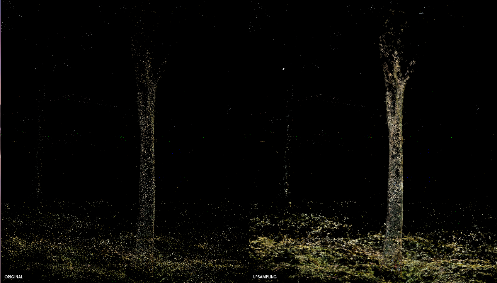

# upsamplingCloudPCL
Upsampling method for upsampling an input cloud using mls method of PCL 1.9.1

## Input file structure support

* .pcd 
* .ply
* .txt
* .xyz

## Output file structure (.pcd)

* umsampled_cloud.pcd 

## Example
 

-------------------
## Compilation
* Set "YOUR OWN" PCL Build DIR in CMakeList.txt e.g: **/opt/pcl-1.9.1/build** and save it.
* Create a "build" folder

in the main folder:

    - cd build  
    - cmake ../src/
    - make
       
        	 
### Test

    cd /build
    ./upsampling_cloud <cloud file> 
    
## Note

You can set  different params for get better results 

    mls.setComputeNormals(true);
    mls.setInputCloud(input_cloud);
    mls.setSearchMethod(kd_tree);
    mls.setSearchRadius(search_radius);
    mls.setUpsamplingMethod(pcl::MovingLeastSquares<pcl::PointXYZRGB, pcl::PointXYZRGB>::UpsamplingMethod::SAMPLE_LOCAL_PLANE);
    mls.setUpsamplingRadius(sampling_radius);
    mls.setUpsamplingStepSize(step_size);
    mls.setPolynomialOrder(pol_order);
    mls.setSqrGaussParam(gauss_param);// (the square of the search radius works best in general)
    mls.setCacheMLSResults(true);//Set whether the mls results should be stored for each point in the input cloud.
    mls.setNumberOfThreads(num_threats);

